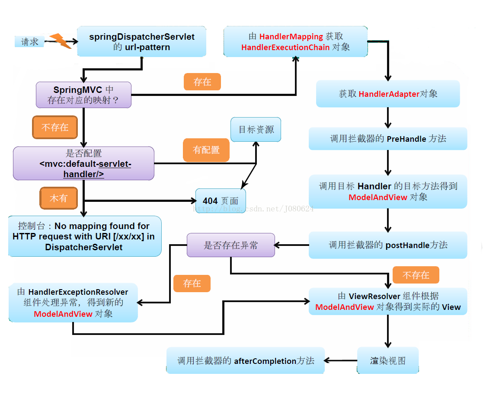

# 学习spring ioc源码分析   
## spring提供的主要IOC容器：
* ClassPathXmlApplicationContext  
* FileSystemXmlApplicationContext  
* XmlBeanFactory（废弃）
## 重要的类（或者接口）：  
* ***BeanFactory*** ：定义一系列的获取bean或者判断是否单例之类的方法  
* ***BeanDefinition*** ：Bean对象在Spring实现中是以BeanDefinition来描述的，Bean的定义类   
* ***BeanDefinitionReader*** ： 资源解析器解析资源，任务是从定义资源（Resource）中加载bean  
* ***Resource*** ： Bean定义资源（绑定配置文件），而后来被BeanDefinitionReader加载出bean  

## BeanDefinition如何定义Bean的  

***描述属性和值***  
有一个方法getPropertyValues（），返回一个MutablePropertyValues类，这个类里面是包含了List<PropertyValue>的属性：PropertyValue对象含有String的name和Object的value
  
***定位Bean的类***  
Definition中含有一个getBeanClassName（）获取bean的class

## BeanDefinitionReader（加载）：  
**功能** ： 
* 继承了DefaultResourceLoader，所以它有了加载资源的能力  
* 本身的功能就是加载Resource的  

**加载过程** ：  
1.调用资源加载器的获取资源方法resourceLoader.getResource(location)，从配置文件中加载成spring资源Resource  
2.再用BeanDefinitionReader将Resource加载成Document对象  
3.从Document中解析出BeanDefinition包装成BeanDefinitionHolder对象 （类的结构如下）  
  
4.将解析好的BeanDefinitionHolder对象向IOC容器中注册  
  
## BeanFactory （注册）：  
***容器存储原理***  
DefaultListableBeanFactory中含有一个Map<String, BeanDefinition> beanDefinitionMap存储名字和Bean定义的映射。  
  

# spring的依赖注入  
## 主要方法：
* .createBeanInstance：生成Bean所包含的java对象实例。
* .populateBean ：对Bean属性的依赖注入进行处理。
## 创建过程：  
***工作类BeanFactory***：大量通过jdk的构造器反射创建和cglib的创建  
## 依赖注入过程：  
***工作类BeanWrapper***：封装Bean的类  
大量采用jdk的反射和内省机制，用到BeanDefinition中的PropertyValues，实现对Bean属性的查找和设置
### java内省机制：Introspector  
* PropertyDescriptor propertyDescriptor = new PropertyDescriptor("username",User.class);找到对属性的描述  
* 通过propertyDescriptor.getWriteMethod()获得这个属性的setter方法  
* 通过propertyDescriptor.getReadMethod()获得这个属性的getter方法 
* 就可以调用这些方法设置属性的值或者获取属性的值
# spring MVC的流程分析
## 重要的类：  
* HandlerMapping：处理url和自己写的方法的映射
* HandlerAdapter：handle的适配器对象，完成对数据验证、转换、格式化工作，调用真实的handle返回ModelAndView对象
* ViewResolver：将ModelAndView转换成我们view返回给用户

流程：

